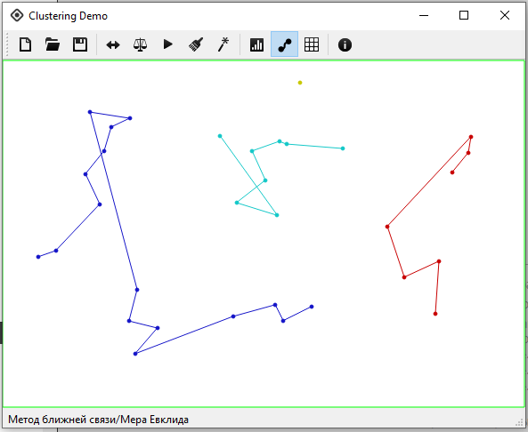
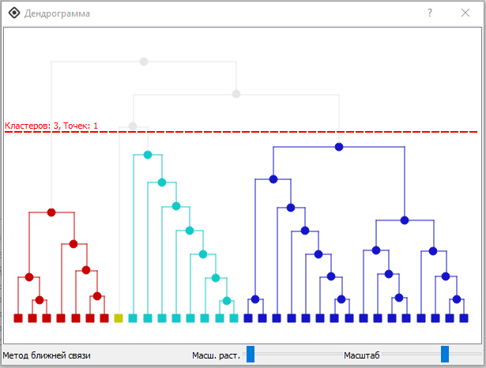

# Clustering Demo

Проект реализован в рамках курса "Интеллектуальный анализ данных" магистратуры по специальности «Информатика и вычислительная техника» факультета «ФАВТ» Вятского государственного университета (ВятГУ) в 2013 году.

Данный проект позволяет визуально продемонстрировать поведение различных методов кластерного анализа.

  
  

 

